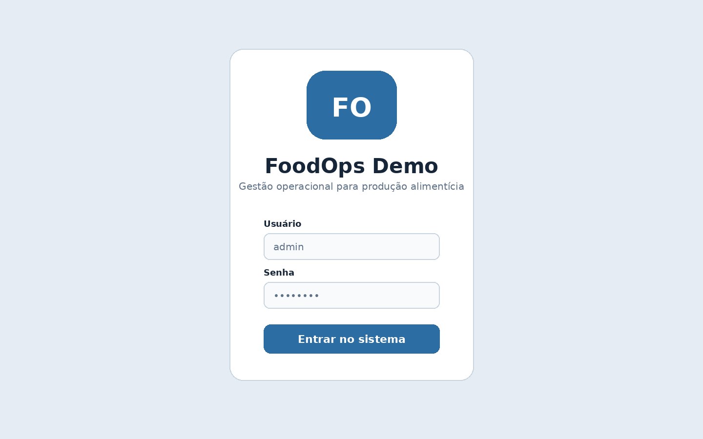
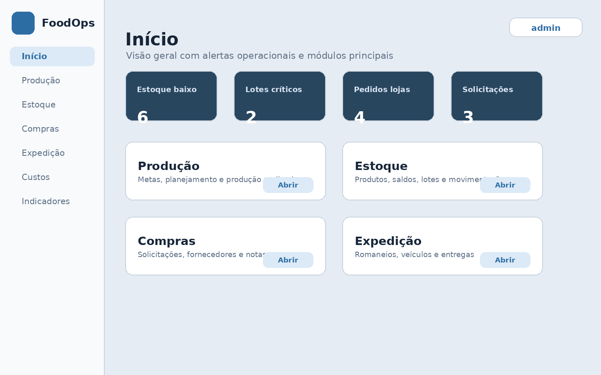
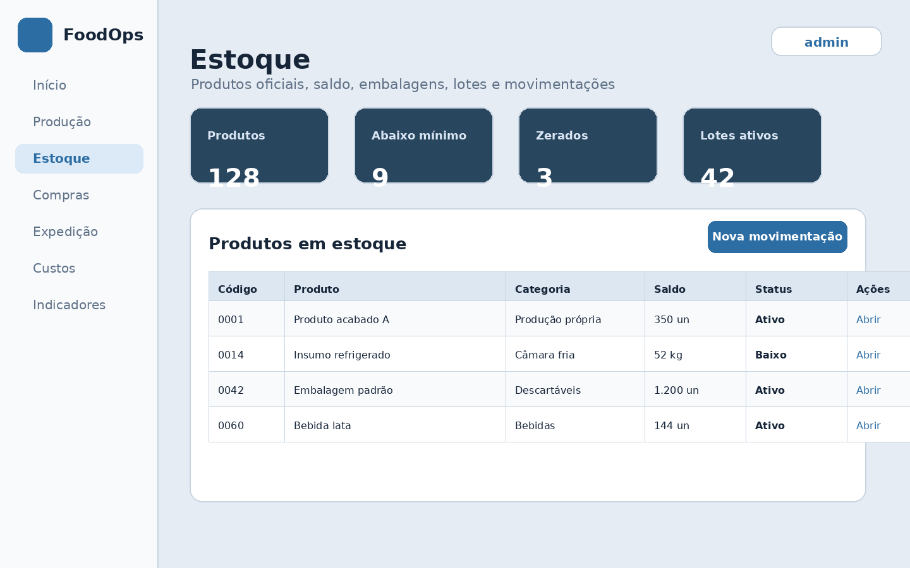
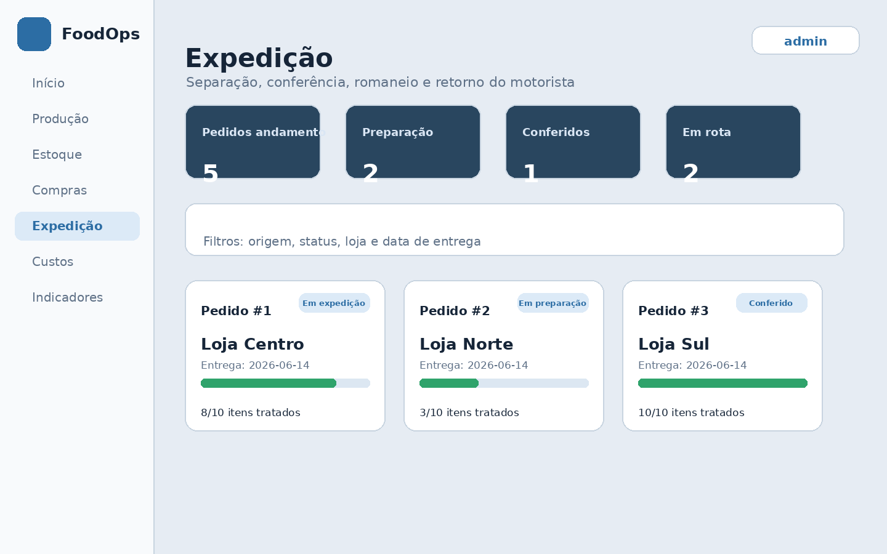
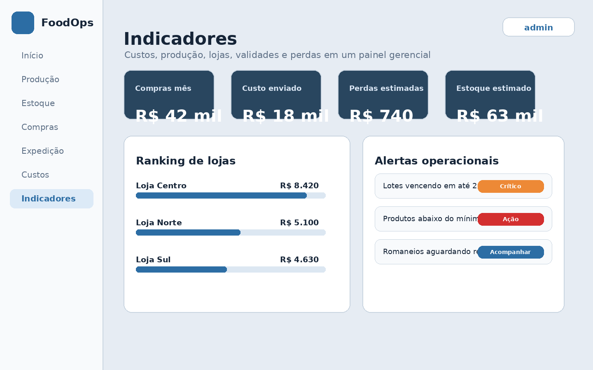

# FoodOps Demo — Sistema de Gestão Operacional para Produção Alimentícia


Sistema web desenvolvido em **Python + Flask + SQLite** para demonstrar a construção de um mini ERP operacional voltado a empresas de produção alimentícia.

> Este repositório é uma **versão genérica para portfólio**, sem dados reais, sem nome de cliente e sem banco de dados de produção.

---

## Problema que o sistema resolve

Pequenas e médias operações alimentícias normalmente controlam produção, estoque, validade, compras, pedidos das lojas e expedição em planilhas, papéis ou sistemas separados. Isso gera retrabalho e dificulta responder perguntas como:

- Quanto preciso produzir a partir dos pedidos das lojas?
- Quais insumos o estoque precisa separar para a produção?
- Qual lote foi enviado para cada loja?
- O que está perto do vencimento?
- Quanto cada loja ou centro de custo consumiu?
- Qual foi o custo previsto versus realizado?

O **FoodOps Demo** centraliza esses fluxos em um sistema administrativo único.

---

## Prints do sistema

### Login


### Dashboard


### Estoque


### Expedição


### Indicadores


---

## Principais funcionalidades

### Produção
- cálculo de produção por cenário e dia;
- metas de segurança;
- pedidos consolidados das lojas;
- planejamento de produção;
- produção realizada;
- tabuleiro normal e tabuleiro misto `18 + 17`;
- etiquetas de produção;
- histórico.

### Ficha técnica
- produtos acabados, massas, recheios e intermediários;
- ficha técnica encadeada;
- versão da ficha usada no planejamento;
- custo por ficha técnica.

### Estoque
- produtos oficiais com código;
- categorias;
- unidade base;
- embalagens e conversões;
- entradas e saídas;
- saldo atual;
- estoque mínimo;
- células de produção;
- transferências internas;
- histórico.

### Compras e notas
- solicitações de compra;
- fornecedores;
- confirmação de compra;
- notas de entrada com vários itens;
- bonificação;
- compras sem movimentação de estoque;
- custo médio e último custo.

### Lojas e expedição
- perfil de loja com acesso restrito;
- pedidos por loja;
- catálogo baseado em produtos disponíveis para venda;
- expedição por origem/almoxarifado;
- separação em lote;
- motorista e veículo;
- romaneio com duas vias;
- baixa de estoque na saída.

### Lotes, validade e rastreabilidade
- criação automática de lote;
- validade por produto;
- FEFO;
- descarte com motivo;
- perdas;
- histórico do lote;
- rastreabilidade até loja, romaneio, motorista e veículo.

### Custos e indicadores
- custo por loja;
- custo por centro de custo;
- custo por produto;
- custo congelado no romaneio;
- indicadores gerenciais de estoque, compras, produção, validades e perdas.

---

## Tecnologias

- Python
- Flask
- SQLite
- Jinja2
- HTML
- CSS
- Pillow
- pywin32 no Windows para impressão direta

---

## Como rodar localmente

### 1. Clone o repositório

```bash
git clone https://github.com/SEU_USUARIO/foodops-producao-estoque-demo.git
cd foodops-producao-estoque-demo
```

### 2. Crie e ative um ambiente virtual

Windows PowerShell:

```powershell
py -m venv .venv
.\.venv\Scripts\Activate.ps1
```

Linux/macOS:

```bash
python3 -m venv .venv
source .venv/bin/activate
```

### 3. Instale as dependências

```bash
pip install -r requirements.txt
```

### 4. Execute

```bash
python app.py
```

Acesse no navegador:

```text
http://127.0.0.1:5000
```

Na primeira execução, o sistema cria automaticamente o banco SQLite local.

---

## Login inicial de demonstração

```text
Usuário: admin
Senha: admin123
```

Também é criado um usuário de produção:

```text
Usuário: producao
Senha: prod123
```

Altere essas senhas antes de usar qualquer ambiente real.

---

## Observações importantes

- Este projeto é uma versão de demonstração para portfólio.
- Não inclui dados reais.
- Não inclui `database.db`.
- O banco é criado localmente na primeira execução.
- A impressão direta de etiquetas depende de Windows + pywin32 + impressora configurada.
- Em ambientes sem Windows, o restante do sistema pode ser demonstrado sem usar impressão direta.
- Antes de qualquer uso real, seria necessário fazer hardening de segurança, testes completos, logs, backups automáticos e revisão de permissões.

---

## Estrutura do projeto

```text
.
├── app.py
├── requirements.txt
├── README.md
├── .gitignore
├── templates/
├── static/
│   ├── style.css
│   ├── ui-v2.css
│   └── img/
├── docs/
│   └── screenshots/
└── tests/
```

---

## O que este projeto demonstra

- modelagem de processo real;
- integração entre módulos;
- controle de estoque e produção;
- fluxo de compra, entrada, validade e expedição;
- construção de interface administrativa;
- uso de Flask, SQLite e Jinja2;
- criação de regras de negócio complexas em sistema web;
- capacidade de evoluir um sistema simples para uma solução operacional ampla.

---

## Status

Projeto em versão de portfólio, com foco em demonstração técnica e visual. Algumas partes ainda exigiriam auditoria, testes de carga, segurança web e homologação operacional antes de produção real.
